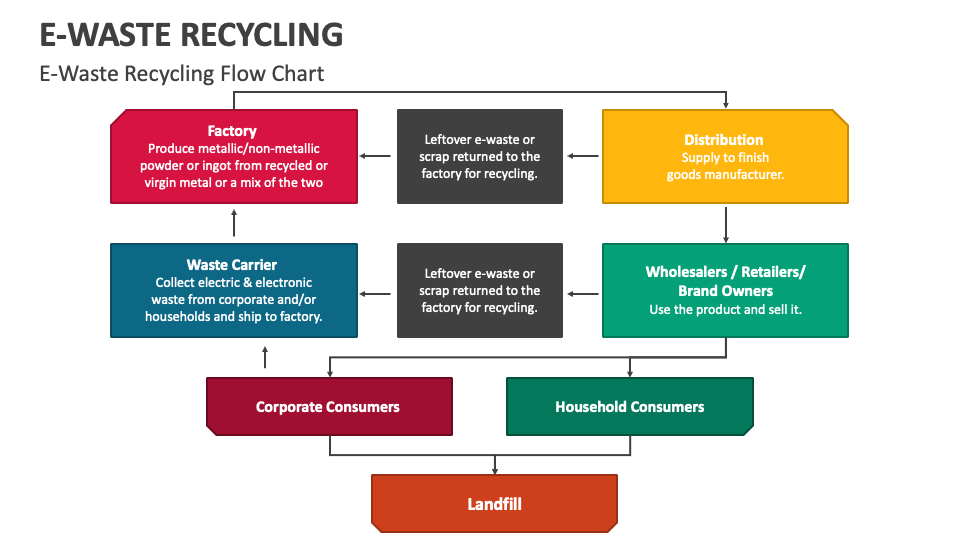
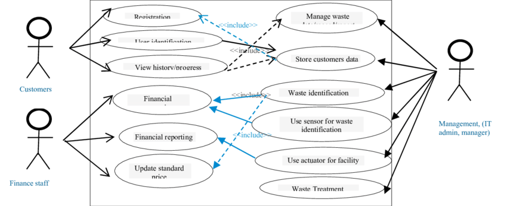

# Smart India Hackathon Workshop
# Date: 17/05/2024
## Register Number: 212223230176
## Name: Sabeeha Shaik
## Problem Title
E-Waste Facility Locator
## Problem Description
Website that tells you the location of the nearest e-waste collection and recycling facility. Offers educational pop-ups on the harmful components of your e-waste and their effects on the environment and human health if not disposed correctly. There could be an option to input the model of your old device and earn credit points relative to the amount of precious metals recovered from the device if disposed correctly.
## Problem Creater's Organization
Ministry of Environment

## Idea

An E-waste Facility Locator tackles the challenge of responsible e-waste disposal by connecting users with nearby drop-off locations. This user-friendly platform allows people to search for facilities based on their location and provides details like accepted items, hours of operation, and any associated fees. It also educates users on what constitutes e-waste and the importance of proper recycling.

## Proposed Solution / Architecture Diagram

## Use Cases

## Technology Stack

Frontend
HTML5: For structuring the content of the web pages.CSS3: For styling the web pages.JavaScript: For adding interactivity and handling user input.Bootstrap: For responsive design and pre-built components to speed up development.

Backend
Node.js: For server-side programming, handling requests and responses.
Express.js: For creating the server and handling routing.
MongoDB: For database management to store facility locations, user data, and credit points.

Additional Tools
Postman: For testing API endpoints.
Git: For version control.
GitHub/GitLab/Bitbucket: For hosting the code repository.
Heroku/Vercel: For deploying the application.

Optional Enhancements
JWT (JSON Web Tokens): For user authentication and secure API endpoints.
Mongoose: For object data modeling (ODM) with MongoDB, making it easier to work with the database.

## Dependencies
Google Maps API: For map functionality to locate the nearest e-waste collection 
facility.
